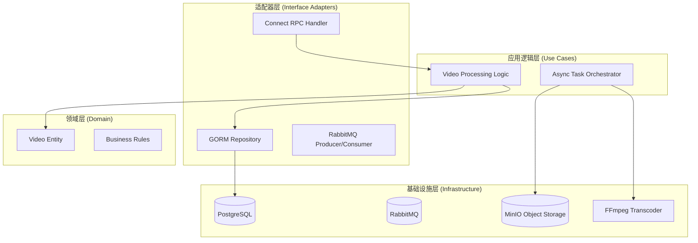

# Cloud-Media

<div align="center">


**云原生分布式视频处理平台**

[特性概览](#-核心特性) • [架构设计](#-系统架构) • [快速开始](#-快速开始) • [API 文档](#-api-接口)

</div>

---

## 📖 项目简介

**Cloud-Media** 是一个生产级标准的分布式视频处理系统，专为解决高并发场景下的视频转码与分发挑战而设计。

项目采用 **整洁架构 (Clean Architecture)** 与 **领域驱动设计 (DDD)** 思想，实现了从视频上传、异步切片 (HLS)、缩略图生成到持久化存储的全链路流程。系统集成了 **OpenTelemetry** 可观测性体系，支持从 API 网关到后台 Worker 的全链路分布式追踪，适用于构建高吞吐、可扩展的流媒体服务。

> **适用场景**：短视频平台后台、在线教育点播服务、企业级媒体资产管理。

---

## ✨ 核心特性

### 🎥 媒体处理引擎
*   **HLS 自适应流**：基于 FFmpeg 实现多码率切片（1080p/720p/480p），支持 HLS 协议分发。
*   **智能宽高比**：内置智能缩放算法，自动识别横/竖屏，拒绝极端比例（1:16/16:1 限制），保持画面原始比例。
*   **视频文件验证**：魔数检测 + FFprobe 双重验证，快速拒绝非视频文件，节约资源。
*   **封面自动截取**：高效提取视频首帧作为预览缩略图。

### 🛡️ 全链路可靠性保障
*   **Transactional Outbox 模式**：消息先存入数据库（与任务同一事务），再异步发布，确保发布失败不丢消息。
*   **RabbitMQ Publisher Confirms**：30秒超时等待 broker 确认，mandatory + returns 处理路由失败。
*   **两层幂等消费保障**：`processed_messages` 去重表（唯一约束）+ SELECT FOR UPDATE 原子状态转换。
*   **自动恢复机制**：定时扫描 pending 事件、stuck 任务，自动清理旧去重记录。
*   **消息持久化**：消息 DeliveryMode=Persistent + 队列 durable，MQ 重启不丢消息。

### 🏗️ 云原生架构
*   **Worker Pool + Queue 模式**：基于 RabbitMQ + KEDA 构建弹性 Worker 池，每个 Pod 单任务处理，支持 Scale-to-Zero。
*   **异步削峰**：基于 RabbitMQ 构建高可靠任务队列，实现 API 层与计算层的彻底解耦。
*   **多云存储支持**：支持 MinIO、AWS S3、Cloudflare R2 等多种 S3 兼容对象存储。
*   **CDN 集成**：支持配置 CDN 加速，替代预签名 URL 提升访问速度。
*   **内外网隔离存储**：设计 **双 Endpoint 模式**，Core Client 走内网流量上传，Signer Client 生成外网预签名 URL，提升安全性与传输效率。
*   **整洁架构**：严格遵循依赖倒置原则，层级分明（Domain/UseCase/Adapter/Infra），易于测试与维护。
*   **Kubernetes 原生**：完整 k3s 部署配置，支持 Kustomize 分层部署，Pod 反亲和性 + 容忍度配置避免单点故障。

### 🔭 可观测性体系
*   **分布式追踪**：集成 OpenTelemetry + Grafana Tempo，实现跨 HTTP 与 AMQP 的 Context 传播，全链路 Trace 可视化。
*   **Span 状态管理**：错误时自动设置 Span Status 为 Error，成功时设置为 OK，在 Grafana 中正确显示。
*   **日志聚合**：Loki + Grafana 日志栈，支持 trace_id 关联查询。
*   **监控指标**：OpenTelemetry Metrics 埋点，覆盖 API 延迟、队列堆积量、转码耗时等关键 SLI/SLO 指标。
*   **健康检查**：标准的 Kubernetes 探针接口（`/health/live`, `/health/ready`），Docker Compose 中已配置健康检查。
*   **优雅降级**：traces/metrics 初始化失败时降级为 noop，不影响核心业务。

### 🛡️ 质量保障 (QA)
*   **E2E 测试体系**：包含完整的端到端集成测试，自动生成可视化的 HTML 测试报告。
*   **负载测试工具**：支持高并发任务提交、状态轮询、性能统计（P50/P95/P99、吞吐量）。
*   **单元测试**：pkg/errors、pkg/ffmpeg、pkg/telemetry 等核心包完整测试覆盖。
*   **统一错误处理**：pkg/errors 包提供统一的错误类型和错误码，支持 Connect RPC 错误映射。
*   **CI/CD 流水线**：基于 GitHub Actions 实现自动化构建、测试与镜像推送。

---

## 🛠 技术栈

| 领域 | 技术选型 | 说明 |
| :--- | :--- | :--- |
| **语言** | Golang (1.23+) | 高性能并发处理 |
| **RPC 框架** | [Connect RPC](https://connectrpc.com/) | 支持 gRPC/HTTP 双协议，浏览器友好 |
| **架构设计** | Clean Architecture | 领域驱动，依赖注入 (Google Wire) |
| **消息队列** | RabbitMQ | 异步任务解耦，确保最终一致性 |
| **存储** | PostgreSQL | 任务状态持久化 |
| **对象存储** | MinIO / AWS S3 / Cloudflare R2 | 支持多种 S3 兼容存储 |
| **CDN** | Cloudflare CDN (可选) | 全球边缘节点加速 |
| **转码核心** | FFmpeg | 行业标准音视频处理工具 |
| **可观测性** | OpenTelemetry + LGTM Stack | 日志(Loki) + 追踪(Tempo) + 指标(Mimir) |
| **自动扩缩容** | KEDA | 基于队列长度 + CPU 使用率，支持 Scale-to-Zero |
| **ORM** | GORM | 数据持久层封装 |
| **IDL 管理** | Protobuf + Buf v2 | 现代化的 API 定义与代码生成 |

---

## 📐 系统架构

### 分层架构图

遵循 **Clean Architecture**，外部依赖向内辐射，核心业务逻辑保持纯净。



### 目录结构

采用 Go 社区标准布局 `golang-standards/project-layout`：

```text
cloud-media/
├── cmd/                  # 应用程序入口 (Main)
├── internal/             # 私有业务代码
│   ├── domain/           # 领域层 (实体, 接口定义)
│   ├── usecase/          # 应用层 (业务编排)
│   ├── adapter/          # 适配层 (RPC Handler, Repo实现)
│   └── infrastructure/   # 基础层 (DB驱动, MQ客户端, FFmpeg封装)
├── pkg/                  # 公共库 (Logger, Metrics, Interceptor)
├── proto/                # API 定义 (Protobuf)
├── test/                 # E2E 测试与负载测试工具
├── k8s/                  # Kubernetes 部署配置
└── scripts/              # 开发辅助脚本
```

---

## 🚀 快速开始

### 前置要求
*   Docker & Docker Compose
*   Go 1.23+ (仅本地开发需要)

### 一键启动 (推荐)

我们提供了完整的 Docker Compose 环境，包含所有依赖服务。

```bash
# 1. 克隆仓库
git clone https://github.com/frozenf1sh/cloud-media.git
cd cloud-media

# 2. 启动服务集群
docker compose up -d
```

启动后，您可以访问以下服务：

| 服务 | 地址 | 凭证 (默认) |
| :--- | :--- | :--- |
| **API Server** | `http://localhost:8080` | - |
| **MinIO Console** | `http://localhost:9001` | `rootadmin` / `rootpassword` |
| **RabbitMQ** | `http://localhost:15672` | `guest` / `guest` |
| **Grafana** | `http://localhost:3000` | `admin` / `password` |

### 配置文件

配置模板位于 `config/` 目录：

| 配置文件 | 说明 |
| :--- | :--- |
| `config.api-server.example.yaml` | API Server 配置模板 |
| `config.worker.example.yaml` | Worker 配置模板 |
| `config.api-server.docker.yaml` | API Server Docker 环境配置 |
| `config.worker.docker.yaml` | Worker Docker 环境配置 |

> **Kubernetes 部署**：k8s 环境中使用统一的 ConfigMap (`k8s/apps/common-configmap.yaml`)，通过环境变量覆盖服务特定配置。

### 开发脚本

项目提供了便捷脚本以简化开发流程：

| 脚本 | 说明 |
| :--- | :--- |
| `./scripts/wiregen.sh` | 生成 Wire 依赖注入代码（api-server + worker） |
| `./scripts/bufgen.sh` | 生成 Protobuf Connect RPC 代码 |
| `./scripts/rebuild.sh` | 重新构建 Docker 镜像并重启服务 |
| `./scripts/seal-secrets.sh` | 加密所有 Kubernetes Secrets |

### 测试工具

#### 端到端测试 (E2E)

运行端到端测试以验证系统功能完整性：

```bash
go run ./test/e2e -video ./test/test.mp4

# 测试完成后，打开生成的 test_result.html 查看可视化报告
open test_result.html
```

#### 负载测试

使用负载测试工具进行高并发压测：

```bash
# 基本用法
go run ./test/loadtest -video ./test/test.mp4 -count 200 -concurrency 10

# 上传复用模式（只上传一次文件，所有任务复用）
go run ./test/loadtest -video ./test/test.mp4 -count 200 -reuse-upload

# 指定 k8s API 地址
go run ./test/loadtest -video ./test/test.mp4 -api-addr http://media-api.frozenf1sh.loc/
```

负载测试输出包含：
- 任务提交成功率
- 吞吐量 (tasks/sec)
- 队列时间统计 (P50/P95/P99)
- 处理时间统计 (P50/P95/P99)
- 失败任务详情

### Kubernetes (k3s) 部署

项目提供完整的 k3s 部署配置，支持 Kustomize 分层部署：

```bash
# 前置要求
# - Kubernetes 集群（k3s 或其他）
# - kubectl 已配置并能连接集群
# - kubeseal 已安装（用于 Sealed Secrets）

# 1. 生成 Sealed Secrets（首次部署）
./scripts/seal-secrets.sh

# 2. 完全重新部署
kubectl apply -k k8s/

# 3. 观察部署进度
kubectl get pods -n cloud-media -w
```

---

## 🔌 API 接口

服务采用 Protobuf 定义，支持 gRPC 与 HTTP/JSON 调用。

### 1. 获取上传地址

```bash
curl -X POST http://localhost:8080/api.v1.VideoService/GetUploadURL \
  -H "Content-Type: application/json" \
  -d '{
    "task_id": "demo-task-01",
    "file_name": "demo.mp4",
    "file_size": 10485760
  }'
```

### 2. 提交转码任务

```bash
curl -X POST http://localhost:8080/api.v1.VideoService/SubmitTask \
  -H "Content-Type: application/json" \
  -d '{
    "task_id": "demo-task-01",
    "source_bucket": "media-input",
    "source_key": "videos/demo.mp4"
  }'
```

### 3. 查询任务状态

```bash
curl -X POST http://localhost:8080/api.v1.VideoService/GetTaskStatus \
  -H "Content-Type: application/json" \
  -d '{"task_id": "demo-task-01"}'
```

> 完整 API 定义请参考 `proto/` 目录下的 `.proto` 文件。

---

## 💡 设计亮点

### 多云存储与 CDN 集成
系统采用**抽象接口 + 实现分离**设计：
*   **Domain 接口**: `ObjectStorage` 接口定义在领域层，与具体实现解耦。
*   **多后端支持**: 同一套代码支持 MinIO、AWS S3、Cloudflare R2。
*   **CDN 优先模式**: 启用 CDN 后，`GetPresignedURL` 直接返回 CDN URL，无需预签名，提升访问速度。

### MinIO 双 Endpoint 隔离设计
出于安全性与网络拓扑考虑，系统实现了**双客户端模式**：
*   **Internal Client (Core)**: 配置内网 DNS (`minio:9000`)，用于 Worker 节点与存储桶之间的高速数据传输，不消耗公网带宽。
*   **External Client (Signer)**: 配置公网域名/IP，专门用于生成 Presigned URL，确保前端用户能直接通过浏览器上传/下载，而无需流量经过 API Server。

### 全链路可观测性
系统解决了异步架构中 Trace Context 丢失的痛点：
1.  **API 层**: 拦截 HTTP Headers，提取 W3C Trace Context。
2.  **MQ 层**: 将 Trace Context 注入 AMQP Header。
3.  **Worker 层**: 消费时提取 Context，创建子 Span。
    *   结果：在 Grafana Tempo 中可看到 `HTTP Req -> MQ Publish -> MQ Consume -> FFmpeg Process` 的完整瀑布图。
    *   日志关联：Loki 日志自动包含 `trace_id`，可在 Grafana 中从 Trace 直接跳转到相关日志。

---

## 🔮 未来规划

*   [ ] **GPU 加速**: 集成 NVENC 硬件转码支持
*   [ ] **WebHook**: 任务完成回调通知
*   [ ] **大视频分片上传**: S3 Multipart Upload 支持，断点续传
*   [ ] **管道流处理**: 使用 io.Pipe 边下边转码，减少磁盘 I/O

---

## 🤝 贡献与许可

欢迎提交 PR 或 Issue！

本项目基于 [Apache License 2.0](LICENSE) 开源。
